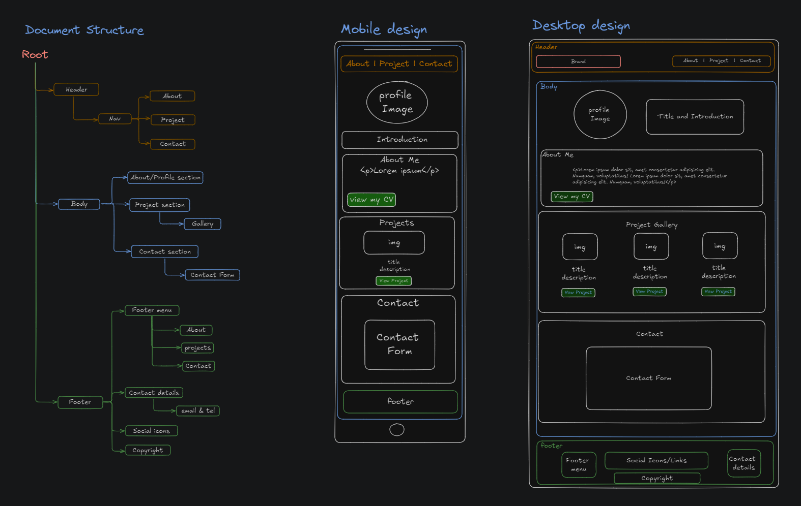

# Personal Portfolio Webpage

**Objective:**

This is the sbc challenge. The aim is to build and style a personal portfolio webpage from scratch. The project should showcase the skills we've learned during the week one session, utilizing HTML and CSS, and it should be deployed using [GitHub Pages](https://docs.github.com/en/pages).

## Table of Content

- [Requirements](#Requirements)
- [Design](#Design)
- [Build_with](#Build_with)
- [Testing](#Testing)
- [Links](#Links)
- [Questions](#Questions)

## Requirements:

**1. Use Semantic HTML Elements:**

- The webpage should use semantic HTML elements such as `<header>`, `<section>`, `<article>`, `<footer>`.
  - **Header**: Include name and a navigation bar listing `About`, `Projects`, `Contact`.
  - **About Section**: Add a profile picture and a short bio.
  - **Projects Section**: Showcase at least **two images** of imaginary projects, with a brief description of each.
  - **Contact Section**: Include contact details in a form format (name, email, message).
  - **Footer**: Add copyright information or any relevant details.

**2. CSS Styling:**

- The page is styled using an external CSS file.
- Fonts, colors, and layout are customized.
- CSS selectors (class, ID, element, and universal(\*)) are used appropriately.
- Use **CSS Flexbox** or **Grid** to better organize your layout.
- Add hover effects to buttons and links.
- Create a sticky navigation bar.

**3. Contact Form:**

- Link **email** (using `mailto:`) and **phone number** (using `tel:`).
- In the **contact section**, include:
  - A form with input fields for the user's name, email, and a message.
  - A submit button (this doesn't need to be functional but should be styled).
- Dropdown menus (`<select>` elements)
- Radio buttons (`<input type="radio">`)
- Checkboxes (`<input type="checkbox">`)
- Date pickers (`<input type="date">`)

**4. Responsive Layout:**

- The page should be responsive and display properly on different screen sizes.

**5. Deployment on GitHub Pages:**

- The page should be deployed on **GitHub Pages** and accessible via a shared URL.

## Design

**Design and Document structure**

## Build_with

     
[Fontawesome](https://fontawesome.com/icons)

## Testing

## Links

### Deployed website link

[Personal Portfolio webpage](https://chari00.github.io/sbc-week1-assignment/)

### Resources Links

#### Semantic HTML Elements

- [HTML Elements Reference](https://developer.mozilla.org/en-US/docs/Web/HTML/Element)
- [W3Schools](https://www.w3schools.com/html/html5_semantic_elements.asp)

#### Styling Resource

- [CSS documentation](https://developer.mozilla.org/en-US/docs/Web/CSS)
- [Fontawesome Documentation](https://docs.fontawesome.com/web/setup/get-started)

#### GitHub Workflow

- [Git Documentation: Adding Files](https://git-scm.com/docs/git-add)
- [How to Track and Commit Changes in Git](https://www.atlassian.com/git/tutorials/saving-changes)
- [Working with Git: Basic Commands](https://guides.github.com/introduction/git-handbook/#basic)

#### Deploying to GitHub Pages

- [GitHub Pages Documentation](https://docs.github.com/en/pages)
- [GitHub Pages Tutorial](https://www.youtube.com/watch?v=BT4WzyT2g8k)

## Questions

For questions and comments please email me at macharitocruzuk@gmail.com.
